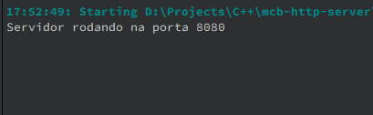

# MCB-HTTP-SERVER

An http server created in C++ (qmake) that aims to receive HTTP requests from all verbs (GET, HEAD, POST, DELETE, PATH, etc.) and print everything (HEADERs, BODY, etc.) that was sent to the console received (useful for Developers)

## What's done:

- The HTTP server
- Printing of results

## What remains to be finished:

- Colors in printing according to the syntax, json, for example..

## Challenges:

- Create in pure C being independent of DLLs